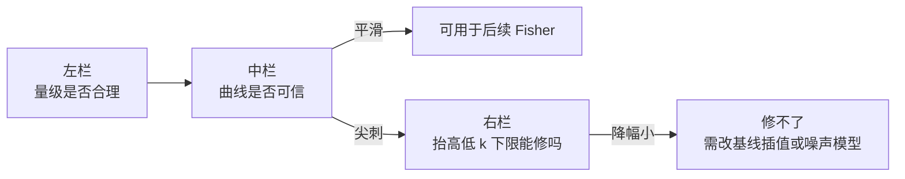

# 9.16 噪声方差的红移与低波数诊断

配置：Δz=0.01，Fisher 与体素方差上限均为 0.363 Mpc⁻¹。
基准逐箱重算与主程序 CSV 核对通过；新增径向截断通过独立小盒子三维求和检查。

## 定义

测试每个红移节点的实际最低有效总波数 k_min(z) 加 0.01、0.02、0.03 Mpc⁻¹；
保留原仪器掩码、视向下限、sinc 窗口和盒子格点。各节点计算后再按原权重平均。
empty_modes 表示没有保留模式，此时零是空和，不表示仪器热噪声消失。

## 简要结论

- 三个测试增量中的最高下限为 0.258429 Mpc⁻¹；全空测试数为 0。
- 提高下限后最大的方差降幅为 10.36%。
- 邻点突起比是细采样点方差除以两侧点均值；大于1.25仅用来筛查局部尖峰。
- ska_mid1_interferom：最大相邻箱变化 +12.85% （z=0.365004→0.375003），分解主项为其他响应变化。该局部细采样的最高邻点突起比为 1.001。
- chime_icyl：最大相邻箱变化 +31.15% （z=1.267712→1.277712），分解主项为共有模式的密度变化。该局部细采样的最高邻点突起比为 1.004。
- hirax_interferom：最大相邻箱变化 +2.84% （z=0.787719→0.797719），分解主项为其他响应变化。该局部细采样的最高邻点突起比为 1.000。
- tianlai_icyl：最大相邻箱变化 +59.06% （z=0.717378→0.727377），分解主项为模式进入。该局部细采样的最高邻点突起比为 4.403。
- meerkat_b1_interferom：最大相邻箱变化 +8.35% （z=0.431644→0.441643），分解主项为其他响应变化。该局部细采样的最高邻点突起比为 1.004。

## 图 `noise_z_k_diagnostics.png` 读法

### 1. 三栏画的是同一个量

该图由 `plots()` 生成：5 行 = 仪器，3 列 = 三种问法，三栏是同一个物理量的不同侧面。
纵横单位是 mK²（体素热噪声方差，**不含信号**）。

左、中栏的纵轴由 `integrate()` 给出：

```
σ_N²(z) = (1/V_box) · Σ_k  P_N(k) · W_⊥(k_⊥)² · W_∥(k_∥)²
```

求和范围是该仪器在该红移**实际保留的离散 Fourier 模式**：总波数 ≤ k_max、
前景楔/视向下限之上（下限记为 k_min(z)）、k_⊥ 在 FOV 与 Nyquist 以内；
W_⊥、W_∥ 是 transverse_window_sum 与 longitudinal_window（体素 sinc 窗口）。
换句话说，它是热噪声功率谱 P_N 的**实空间对应物**：单个体素里噪声的方差。

P_N 本身来自 `baofisher_k.Cnoise`，其中对基线密度的依赖是

```
σ_T² = T_sys² · S_area / (Δν · t_tot · n(u)) · FOV²,   代码里 return invbeam2/n_u
```
即 **P_N ∝ 1/n(u)**（n(u) = 基线密度，只保留径向平均）。第 4 节的尖峰异常就是这一条造成的。

**它为什么要紧**：Fisher forecast 里噪声以 (P_s+P_N) 进分母（见 `fisher_at_z` 的 `denom`），
所以这数量级直接决定 σ(f_NL) 的可信区间宽度。这张图是噪声侧的可信度体检，不是结果本身。

### 2. 三栏各回答什么

|栏|代码入口|这一栏问什么|怎么读|
|---|---|---|---|
|左：Voxel variance|`integrate(s)`|单个体素热噪声方差随 z 的绝对量级|对数轴。随 z 上升属预期，只做量级体检，不负责发现问题|
|中：Fine snapshots|`snapshot` 在最大箱变化处细采样 81 点|该变化是真趋势还是数值假象|平滑 = 可信；孤立尖刺 = 伪影|
|右：Variance reduction|`integrate(s, s.k_min+Δ)`|在掩码下限 k_min(z) 之上再抬高 Δ 能删掉多少方差|高 = 噪声集中在最低 k；贴 0 = 砍低 k 无用|

中栏的判据是**邻点突起比** = 细采样点方差 ÷ 两侧点均值（`report` 在简要结论里逐仪器给出）。
阈值 1.25 只用于筛查，**不是物理突变判据**。

### 3. 左栏：绝对量级

这一栏只回答「量级对不对」。曲线随 z 上升是这批仪器的共同行为，成因是多个因子叠加
（观测频率下降使系统温度上升、固定物理基线对应的 u 覆盖随 z 平移、体素对应的共动体积变化）；
本脚本不把噪声拆解到这一层，因此左栏**不作为物理结论**，只用来对照仪器间的相对优劣与量级。

### 4. 中栏：可信度检查（最关键的一栏）

`plots()` 先取该仪器相邻箱变化最大的区间，再用 81 个点细采样放大 2 个箱宽。
物理趋势在 10 倍加密下应当保持平滑；只有数值假象才会表现为孤立尖刺。

|仪器|最大相邻箱变化|邻点突起比|判读|
|---|---:|---:|---|
|ska_mid1_interferom|+12.85%（z=0.365004→0.375003）|1.001|平滑，真实趋势|
|chime_icyl|+31.15%（z=1.267712→1.277712）|1.004|平滑，真实趋势|
|hirax_interferom|+2.84%（z=0.787719→0.797719）|1.000|平滑，真实趋势|
|tianlai_icyl|+59.06%（z=0.717378→0.727377）|4.403|有局部尖峰：数值伪影，不代表物理|
|meerkat_b1_interferom|+8.35%（z=0.431644→0.441643）|1.004|平滑，真实趋势|

判读依据：细采样共采到 5 个「单组贡献 >10%」的尖峰：

|仪器|z|方差 [mK²]|k_perp [Mpc⁻¹]|该组 n(u)|该仪器非热点中位 n(u)|密度塌缩倍数|距密度零点边缘 [Mpc⁻¹]|单组贡献|
|---|---:|---:|---:|---:|---:|---:|---:|---:|
|tianlai_icyl|0.715628|0.0007134|0.094392|0.00617|0.274|44.4|5.93e-07|22.0%|
|tianlai_icyl|0.718628|0.00064|0.093912|0.00677|0.274|40.4|6.45e-07|11.3%|
|tianlai_icyl|0.723378|0.0007479|0.093161|0.00305|0.274|89.8|2.87e-07|22.1%|
|tianlai_icyl|0.725377|0.0007841|0.092848|0.00252|0.274|109|2.36e-07|25.7%|
|tianlai_icyl|0.728377|0.002616|0.092382|0.00102|0.274|268|9.45e-08|77.4%|

这些尖峰全部落在基线密度的零边缘上，机制是：

1. `snapshot()` 里的 density = n(x)/ν² 来自**分段线性**插值，可在若干 x 处取到 0；
2. 随 z 变化，固定的离散 k_⊥ 组沿 n(u) 曲线滑动（波长与共动距离同时改变）；
3. 某个组滑到零点边缘时密度塌缩若干数量级，而 `Cnoise` 的 1/n(u) 被同比例放大；
4. 该组通常包含大量简并 Fourier 模式，于是整体体素方差出现孤立尖刺。

两点提醒：其一，这是**插值伪影，不是仪器物理**；其二，中栏只放大了最大变化区间，
因此本表只覆盖被采到的尖峰，不能据此断言其它红移箱没有同类问题。

### 5. 右栏：噪声来自哪些模式

曲线 = 在仪器原有的掩码下限 k_min(z) 之上**再抬高** Δ 后，被删掉的方差占比
（`integrate(s, s.k_min+Δ)`；代码里画的是 100*(1-variance_ratio)）。
它回答的问题是：「k_min 附近那一小撮最低波数模式，在总噪声里占多少权重」。

- 曲线贴 0 → 噪声来自整个保留带宽，砍低 k 没有作用；
- 曲线高 → 少数最低 k 的模式就吃掉这么多方差。

**z 依赖**：所有仪器都是低 z 高、高 z 趋 0。原因是保留带为 [k_min(z), k_max]，
低 z 时该带较窄、且方差偏带的下沿，加一个固定 Δ 就能咬下可观份额；
高 z 时方差向带的高端（高 k）集中，低 k 下限几乎无效。
取最大测试增量 +0.03 Mpc⁻¹，按 z 的低/高四分位各取降幅中位数：

|仪器|低 z 四分位降幅中位数 [%]|高 z 四分位降幅中位数 [%]|
|---|---:|---:|
|ska_mid1_interferom|2.03|0.14|
|chime_icyl|0.42|0.02|
|hirax_interferom|0.39|0.20|
|tianlai_icyl|2.06|0.13|
|meerkat_b1_interferom|3.07|0.57|

抬高下限只删除非负贡献，所以方差与模式数必然不增；但**方差变小不等于灵敏度提高**：
Fisher 判据仍是 (P_s+P_N)，删低 k 模式会同时删掉信号。右栏降幅大并不说明
「应该去抬高下限」，只说明这部分噪声集中在低 k。

### 6. 三栏合用流程



串起来就是本次的诊断结论：**中栏发现 tianlai_icyl 有 4.403 倍尖刺 → 右栏显示抬高下限最多只降 10.36% 且尖峰仍在 → 说明它修不好这个尖峰**，因为尖峰来自 1/n(u) 的零点边缘，而抬高下限只是删掉一小段低 k 模式。

### 7. 容易误读的地方

- **右栏不是灵敏度提升**。降幅大只表示低 k 权重集中，不表示去掉它就更灵敏。
- **中栏的 25% 阈值只是筛查标记**，不是物理突变判据；判定必须看细采样突起比。
- **`empty_modes` 的零不是「噪声消失」**，那是空集求和，只在极端下限下出现。
- **纵轴单位是 mK²**（不是 μK² 或 nK²）。
- **中栏只覆盖最大变化区间**，其它箱的同类伪影不会被这张图暴露。
- **分辨率有限**：本代码只有径向平均基线密度，能定位模式进出 / 插值区间变化 / 密度变化，
  不能指认具体是哪一对天线造成某个分组的贡献。
- **与主程序 CSV 一致属于自洽性检查**，不是对噪声模型本身的独立验证；
  唯一独立验证是 `verify_radial_sum()`，它只检查求和与截断的正确性。

## 红移变化

下表列出各配置相邻箱比值变化最大的区间。超过25%仅用作筛查标记，不是物理突变判据。
分解列用原箱方差归一化；退出项取负号。基线密度归因是固定旧 n(u)、先更新其他响应再更新密度的明确对照。

|配置|z 区间|方差后/前|进入|退出|密度变化|其他响应|权重变化|
|---|---|---:|---:|---:|---:|---:|---:|
|ska_mid1_interferom|0.365004–0.375003|1.128|+0.0712|-0|-0.0205|+0.0778|-1.56e-05|
|chime_icyl|1.267712–1.277712|1.312|+9.69e-05|-0.0104|+0.291|+0.0306|-1.85e-06|
|hirax_interferom|0.787719–0.797719|1.028|+0.000458|-0|-0.0115|+0.0394|-7.27e-07|
|tianlai_icyl|0.717378–0.727377|1.591|+0.561|-0|-0.019|+0.0487|-2.07e-06|
|meerkat_b1_interferom|0.431644–0.441643|1.084|+0.0348|-0|-0.0187|+0.0675|-6.57e-06|

Tianlai 细采样峰值位于 z=0.728377，方差 0.002616 mK²；
单个横向半径分组 k_perp=0.092382 Mpc⁻¹ 贡献约 77.4%。
该分组距基线密度零边缘仅 9.45e-08 Mpc⁻¹。
这是许多简并 Fourier 模式的分组，不是单一天线对或单一 Fourier 模式。

## 提高下限后的方差保留比例

统计包含空域（比例为零），范围与中位数覆盖该仪器所有有效红移箱。

|配置|增加量 [Mpc⁻¹]|比例最小值|中位数|最大值|全空箱数|部分空箱数|
|---|---:|---:|---:|---:|---:|---:|
|ska_mid1_interferom|0.01|0.9809|0.9995|0.9999|0|0|
|ska_mid1_interferom|0.02|0.945|0.9984|0.9996|0|0|
|ska_mid1_interferom|0.03|0.8979|0.9965|0.9989|0|0|
|chime_icyl|0.01|0.9919|1|1|0|0|
|chime_icyl|0.02|0.9865|0.9999|0.9999|0|0|
|chime_icyl|0.03|0.9796|0.9998|0.9999|0|0|
|hirax_interferom|0.01|0.9993|0.9998|0.9998|0|0|
|hirax_interferom|0.02|0.9975|0.9991|0.9993|0|0|
|hirax_interferom|0.03|0.9946|0.9977|0.9981|0|0|
|tianlai_icyl|0.01|0.9451|0.999|1|0|0|
|tianlai_icyl|0.02|0.9186|0.9975|0.9998|0|0|
|tianlai_icyl|0.03|0.8964|0.9948|0.9996|0|0|
|meerkat_b1_interferom|0.01|0.9903|0.9983|0.9993|0|0|
|meerkat_b1_interferom|0.02|0.9714|0.9947|0.9978|0|0|
|meerkat_b1_interferom|0.03|0.9461|0.9893|0.9952|0|0|

## 如何解释

- 天线对并没有随红移新增；波长和距离变化使固定基线对应的 k_perp 移动。
- 本代码只有径向平均的基线密度，能定位模式进出、插值区间变化和密度变化，不能识别具体哪一对天线。
- CHIME/Tianlai 的零密度边缘可使 1/n(u) 贡献很大；有限离散模式进入边缘时可能出现尖峰。
- 有限格点、硬掩码和分段线性基线插值不保证方差随 z 严格光滑；局部细采样不构成全域收敛证明。
- 提高下限只删除非负贡献，方差及模式数必须不增加；方差变小不等于仪器灵敏度提高。
- 相邻箱分解见 z_transitions.csv；最高波动区间的细采样见 z_fine_snapshots.csv。
