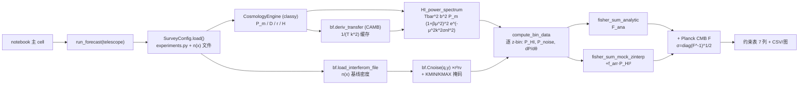

# 备忘录：21 cm 干涉仪望远镜 f_NL Fisher 预报

> 覆盖对象：`research/6.7-interferometer-telescopes-2.ipynb`（主 code cell ~1390 行 + 3 个诊断/对照 cell）
> `bao21cm-master/bao21cm-master/radiofisher/{baofisher.py, baofisher_k.py, experiments.py}`
> mock 数据：`research/mock_fisher_arr.joblib`
> 日期：2026-09-09 ｜ 语言：中文（术语保留英文）
> 状态：本版以原 MEMO 为主体，并入噪声口径讨论（对照 cell 系列）与论文对比，并补全"模块物理意义 + 方案流程 + 调用链"总览（见 §0）

---

# 0. 方案总览：notebook 如何调用各段代码实现 f_NL 的宇宙学目标

## 0.1 目标与工具链一句话

**宇宙学目标**：用 21 cm 中性氢（HI）强度映射（IM）的功率谱，同时约束 7 个参数
$[\ln A_s,\ \Omega_m,\ \omega_b,\ \omega_{cdm},\ n_s,\ w_0,\ f_{\rm NL}]$，其中主角是**局部原初非高斯参数 $f_{\rm NL}$**。$f_{\rm NL}$ 的"指纹"不在功率谱总体幅度，而在**低 k 处偏压的尺度依赖**：$b_{\rm HI}(k,z)=b_0(z)+3(b_0-1)f_{\rm NL}\,\alpha(k,z)$，$\alpha\propto 1/(T(k)k^2)$ 使低 $k$ 模式的信号按 $1/k^2$ 被增强。要捕捉这种小效应，必须对**每台望远镜、每个 $(k,\mu,z)$ 模式**都给出正确的信号幅度与噪声方差，再对 7 参数做 Fisher 预报。

**工具链分工**（各段代码只负责自己那一段物理）：

| 工具/代码                                  | 负责的物理量                                                                                           | 调用方                                                           |
| ------------------------------------------ | ------------------------------------------------------------------------------------------------------ | ---------------------------------------------------------------- |
| **classy (CLASS)**                         | 线性物质功率谱 $P_m(k,z)$、共动距离 $r(z)$、$H(z)$、增长因子 $D(z)$/速率 $f(z)$                        | notebook 的 `CosmologyEngine`（替代 baofisher 自带的 CAMB 引擎） |
| **CAMB**（fortran，经 baofisher 封装）     | 物质转移函数 $T(k)$ → 输出 $1/(T(k)k^2)$                                                               | `baofisher_k.deriv_transfer`（缓存 `transfer_bf_cache.dat`）     |
| **`baofisher.py`**（原始库，未改动）       | 望远镜噪声引擎：`Cnoise`/`Cfg`/`noise_rms_per_voxel(_interferom)` 等 + 望远镜参数来源 `experiments.py` | notebook `import`（经下面的 baofisher_k）                        |
| **`baofisher_k.py`**（= baofisher + 旋钮） | 同 baofisher，另加 `KMIN_EFF/KMAX_EFF` 各向同性 k 掩码（关掉前景楔/几何/非线性等隐式截止）             | notebook 实际 import 对象 `bf`                                   |
| **`experiments.py`**                       | 望远镜字典（`Ndish/Ddish/Tinst/带宽/Sarea/n(x)`…）与宇宙学 fiducial                                    | `TELESCOPES` 分发表                                              |
| **notebook 主 code cell**                  | 信号模型 $P_{\rm HI}$、7 参数偏导、Fisher 求和、CMB 先验、mock 叠加、输出                              | 组织全部上游                                                     |
| **`mock_fisher_arr.joblib`**               | mock 巡天给出的阵列方差 $f_{\rm arr}=\mathrm{Var}(T)/\langle T\rangle^2$（6 个 z 层 × 200×200）        | notebook mock Fisher                                             |
| **Tutorial notebook**                      | 由 100 次模拟实现平均 → 导出 mock joblib                                                               | 上游数据准备（不参与运行）                                       |

## 0.2 数据流：一个模式如何变成一条约束



**核心思想**：解析 Fisher 与 mock Fisher 共享同一套 `compute_bin_data`（P*HI、P_noise、7 组偏导），只差**方差口径**——
解析口径 $\mathrm{Var}*{\rm ana}=(P*{\rm HI}+P*{\rm noise})^2$；mock 口径再把 $f_{\rm arr}(z;k_\perp,k_\parallel)\,P_{\rm HI}^2$ 加进方差分母（z 三维插值、越界规则见 Part Ⅱ/§5）。

## 0.3 主 cell 各模块的物理意义与调用关系（快查表）

| notebook 模块                     | 物理意义（它在回答什么）                                                              | 在流程中的位置                      | 调用了哪里的代码                                              |
| --------------------------------- | ------------------------------------------------------------------------------------- | ----------------------------------- | ------------------------------------------------------------- |
| `normalize_mode`                  | 统一 mode 命名：`cylinder→icyl`，否则 baofisher 按 `mode[0]!='i'` 静默走单碟 → 物理错 | `SurveyConfig.load` 前置            | —（纯逻辑）                                                   |
| `TelescopeSpec` / `TELESCOPES`    | 望远镜目录：`experiments.py` 字典 + 补齐字段 + 是否配 mock                            | 唯一配置源                          | `ex.HIRAX`、`ex.SKA1MIDbase1`…（experiments.py）              |
| mock 常量区（2b）                 | 定义 mock 文件与 6 层 z 中心，给 6 台目标望远镜挂 `mock_file`                         | `run_forecast` 前                   | `mock_fisher_arr.joblib`                                      |
| `expt_to_zmin_zmax`               | 望远镜频率配置 → z 窗口（21 cm 观测唯一覆盖范围）                                     | `SurveyConfig.load`                 | 频率参数（experiments.py）                                    |
| `SurveyConfig.load()`             | 把望远镜字符串装配成可计算的 `expt` 字典（mode/ttot/带宽/n(x)/f_sky/z_bins）          | `run_forecast` 第 1 步              | `bf.load_interferom_file`（文件型 n(x)）                      |
| `CosmologyEngine`                 | 物理工厂：classy 宇宙学 + 转移函数 + 信号模型 + 噪声查询                              | 每台望远镜一个（按 z 缓存）         | classy `Class().compute()`；`bf.deriv_transfer`；`bf.bias_HI` |
| `HIFisherForecast`                | Fisher 引擎：7 参数偏导 + 两种方差求和                                                | `compute_bin_data` → `fisher_sum_*` | classy `pk`/增长；`scipy.interpolate`（mock 插值）            |
| 输出层（§6/6b）                   | 把 Fisher 结果变成可读物理量（约束表/方差图/偏导图/realspace 体素方差）               | `main()` 收尾                       | `bf.noise_rms_per_voxel`（体素口径）                          |
| `planck_fisher_matrix_for_params` | 内嵌 Planck-like CMB 先验（f_NL 对角 σ≈5.1）                                          | 联合 F                              | 常数矩阵                                                      |
| `run_forecast` / `main`           | 单望远镜全流程 / 6 台望远镜批量                                                       | 入口                                | 全部以上                                                      |

## 0.4 端到端调用链（`ska_mid1_interferom` 为例，函数级）

```
notebook 主 cell 末尾: main()
└─ run_forecast('ska_mid1_interferom')
   ├─ cfg = SurveyConfig(...).load()
   │   ├─ TELESCOPES[...] = TelescopeSpec(ex.SKA1MIDbase1, mode_override='interferom', mock_file=...)
   │   │     └─ experiments.py: SKA1MIDbase1（190×15 m…, n(x)='array_config/nx_SKAM190_dec30.dat'）
   │   ├─ normalize_mode('interferom')            # mode 规范化
   │   ├─ ex['ttot'] = t_obs_hours·3600·1e6       # s·MHz
   │   ├─ bf.load_interferom_file(...)            # baofisher_k：n(x)→插值（KMIN_EFF>0 ⇒ 边缘填充）
   │   └─ expt_to_zmin_zmax(expt)                 # → z_bins=(0.250,3.250)
   ├─ engine = get_engine(cfg) → CosmologyEngine   # classy 一次 compute；转移函数懒加载
   │     └─ get_baofisher_transfer() → bf.deriv_transfer(cosmo_bf, 'transfer_bf_cache.dat', kref=…) → CAMB
   ├─ fc = HIFisherForecast(engine, cfg)
   ├─ cache = fc.compute_bin_data(expt)            # 6 bins × 50 k × 100 μ
   │   ├─ engine.HI_power_spectrum(ks, z_mid, mu)  # 信号：classy pk + bias/RSD/FoG
   │   ├─ engine.P_noise_grid(...)                 # bf.Cnoise(q,y) × r²rν；≥0.5·INF ⇒ inf
   │   └─ dP/dθ：f_NL 解析；其余 ±ε → update_cosmology() → classy 重算
   ├─ F_ana = fc.fisher_sum_analytic(cache)
   ├─ mock_list = joblib.load(MOCK_FILE)
   ├─ F_mock = fc.fisher_sum_mock_zinterp(cache, mock_list)   # scipy RegularGridInterpolator 3D
   └─ _assemble_result(...) → planck_fisher_matrix_for_params → F+F_cmb → σ
main() 收尾：build_curves → 图；compute_realspace_variance_table → bf.noise_rms_per_voxel；存 CSV
```

> 诊断 cell（cell 3/4）不是主流程：cell 3 复用主 cell 命名空间比较 $\mathrm{Var_{mock}}$ vs $\mathrm{Var_{ana}}$；
> cell 4 是**自包含**的单碟 vs 干涉严格对照（不 import 主 cell，自己调 `bf.Cnoise`），详见 Part Ⅲ。

## 0.5 本文档导航

- **Part Ⅰ**：文件版本关系、16 轮 AI 问答→实现的迭代复盘、baofisher_k 改动实证、遗留风险。
- **Part Ⅱ**：主 cell 每个模块的宇宙学解读、bin 语义、参数速查表。
- **Part Ⅲ**（并入自第二份 memo 的对话讨论）：噪声与"体素方差"口径三层辨析（ttot、口径 A/B、95×、逐模 Fisher 随 z 反转、数值表）。
- **Part Ⅳ**：与 arXiv:2602.03313v2 论文噪声定义的对比。
- **附录**：文件级修改核对 + 会话纠错记录。

---

# Part Ⅰ　代码演进与 AI 协作复盘

## Ⅰ.0 文件地图与角色

| 文件                                    | 角色                                                                                                                                                                                     |
| --------------------------------------- | ---------------------------------------------------------------------------------------------------------------------------------------------------------------------------------------- |
| `6.7-interferometer-telescopes-2.ipynb` | 主工作簿。**主流程 = 1 个 code cell**（定义全部类/函数 + 末尾直接 `main()`，~1390 行）；其后另有 3 个**诊断/对照 cell**（markdown 说明 + 诊断 code + 严格单碟 vs 干涉对照 code，见 Ⅱ.1） |
| `radiofisher/baofisher.py`              | baofisher 原始代码（Phil Bull & Pedro Ferreira），**未修改**（基线）；已含 `noise_rms_per_voxel` 与 `noise_rms_per_voxel_interferom` 两个 convenience 口径函数（非 baofisher_k 新增）    |
| `radiofisher/baofisher_k.py`            | **被用户/本会话改造的版本**：相对 baofisher.py 仅 +4 处改动块（+54/−18 行，净 +38 行），全部用于"用户自定义各向同性 k 上下限"旋钮（KMIN_EFF/KMAX_EFF，详见 Ⅰ.4）                         |
| `radiofisher/experiments.py`            | 望远镜/宇宙学/前景配置字典（`ex.HIRAX`、`ex.SKA1MIDbase1`、`cosmo`、`USE`、`SURVEY`…）                                                                                                   |
| `mock_fisher_arr.joblib`                | mock 巡天给出的 6 个红移层阵列方差 `fisher_arr = Var(T)/⟨T⟩²`（每层 200×200，位于 (k⊥, k∥) 网格）                                                                                        |
| `CAMB`、classy                          | CAMB：baofisher 转移函数/功率谱来源；classy(CLASS)：notebook 自建宇宙学引擎                                                                                                              |

> **版本现状（2026-09-09 磁盘核实）**：主 code cell 顶部旋钮为 `bf.KMIN_EFF=5.0e-3; bf.KMAX_EFF=0.535`，`SurveyConfig.k_min/k_max=5e-3/0.535`（上下限与网格已一致）。主 cell 之后追加的 3 个 cell 只做诊断，不参与主流程：
>
> - **cell 2（markdown）**：Var_mock 与解析方差比较的判据说明；
> - **cell 3（诊断 code）**：在参考 z bin 画 Var*mock vs Var_ana / ratio vs k（多 μ）/ ratio 二维图，输出 `outputs/diag*\*\_{tel}.png`；
> - **cell 4（严格对照 code）**：`ska_mid1` 单碟 vs 干涉**同参数**对照（`T_OBS_H=1e4 h`），输出口径 (A)/(B) 表与 P_noise 曲线（Part Ⅲ 的全部数值来自它）。

## Ⅰ.1 科学目标（问题链的原点）

用 21 cm 强度映射（IM）**干涉仪望远镜**测量 $f_{\rm NL}$。$f_{\rm NL}$ 通过**尺度相关偏压**进入 HI 功率谱：

$$
b_{\rm HI}(k,z)=b_0(z)+\underbrace{3(b_0-1)\,f_{\rm NL}\,\alpha(k,z)}_{\text{原初非高斯偏压}},\qquad
\alpha(k,z)=\Big(\frac{H_0}{c}\Big)^2\Omega_m\,\delta_c\cdot\frac{1}{T(k)k^2}\cdot\frac{1}{D(z)}
$$

预报工具是 **Fisher 矩阵**：解析方差 $(P_{\rm HI}+P_{\rm noise})^2$ 已实现；另一条线是 **mock 巡天**给出的阵列（arrangement）方差 $f_{\rm arr}P_{\rm HI}^2$。整段会话把"解析 + mock(z 对齐)"整合进一个 notebook，并补上 k 上下限的用户旋钮。

## Ⅰ.2 迭代时间线（按问题顺序）

### 阶段 A：概念澄清（Q1–Q5，纯问答）

| #   | 问题                                | 结论（成为后续代码依据）                                                                                                                                                                                                                                                                                                                        |
| --- | ----------------------------------- | ----------------------------------------------------------------------------------------------------------------------------------------------------------------------------------------------------------------------------------------------------------------------------------------------------------------------------------------------- | --- | ------------------------------------------------------------------------------- |
| Q1  | 解析与 mock 如何约束 $f_{\rm NL}$？ | Fisher 全流程：偏压模型 → $P_{\rm HI}(k,\mu,z)$ 及 $\partial P/\partial f_{\rm NL}$ → 噪声 $P_{\rm noise}$(baofisher `Cnoise`) → 每个 z-bin 体积加权求和 $F_{ab}=\sum V\frac{k^3}{8\pi^2}\Delta\ln k\,\frac{2}{N_\mu}(\partial_aP\partial_bP)/(P_{\rm HI}+P_{\rm noise})^2$；mock 只在有 `mock_file` 的望远镜上额外加 $f_{\rm arr}P_{\rm HI}^2$ |
| Q2  | 中间如何插值？                      | (k,μ) 网格逐点映射到 (k⊥,k∥)：$k*\perp=k\sqrt{1-\mu^2},\ k*\parallel=k                                                                                                                                                                                                                                                                          | \mu | $，在 mock 的 200×200 网格上用 `RegularGridInterpolator` 双线性取 $f_{\rm arr}$ |
| Q3  | z 维度、望远镜/mock 红移怎么处理？  | **当时的坑**：代码无 z 插值，只按 bin 序号硬配（`mock_indices[i]=i`）。SKA 恰好 z_mid=0.5…3.0 与 mock 对齐是**巧合**；`cv_z0to3` 错位；chime/hirax/tianlai/meerkat bin 数≠6 甚至被静默跳过                                                                                                                                                      |
| Q4  | 解析与 mock 方差相加时 z 对齐了吗？ | 都没有对齐、没有插值                                                                                                                                                                                                                                                                                                                            |
| Q5  | 怎样插值使 z 对齐？                 | 4 步方案：① mock z 中心 `linspace(0.5,3.0,6)`；② 望远镜每 bin z_mid 与 mock 层匹配/层间线性插值；③ z 越界 clip 到边界；④ 越出 k 网格 `fill_value=0`（退回纯解析）。→ 此方案落地为 B2 补丁                                                                                                                                                       |

### 阶段 B：z 对齐实现（Q6–Q7）

- **Q6「开始修改代码」**：以 **B2 补丁 cell** 插入 notebook，新增 `fisher_sum_mock_zinterp(self, z_edges_and_bin_data, mock_list)`：把 6 层 mock 沿 z 堆成 3D 立方体 `(nz,200,200)`，用 `RegularGridInterpolator((z_mock,k⊥,k∥), cube, bounds_error=False, fill_value=0.0)` 逐 bin 查询；`Var_mock = f_arr·P_HI²`，与解析方差逆方差相加。用户随后把 demo 循环改成跑全部 6 台望远镜。
- **Q7 各 cell 做什么、为何重复输出**：cell1=A3（定义+自动全跑）、cell2=B1b（绘图修复）、cell3=空、cell4=探测、cell5=B2（又跑一遍 SURVEYS）→ **输出重复的根因**：① cell1 末尾 `if __name__=="__main__": main()` 在 Jupyter 恒真 → 定义 cell 自己跑一遍；② cell5 对 SURVEYS 再跑一遍；③ 旧/新 `run_forecast` 各自输出。

### 阶段 C：单 cell 整合（Q8–Q10）

- **Q8 能否整合成 1 个 cell、删冗余、保留一份「解析 + mock(z 对齐)」结果** → 给出整合方案。
- **Q9** 确认决策：cell1 旧代码**整体替换为整合 cell**、删除空 cell 与探测 cell、B1b/B2 并入。
- **Q10「开始完成修改和整合」**：写一次性脚本 `research/_integrate_67.py` 并执行：
  - A 在定义区前插入 mock 常量（`MOCK_FILE/MOCK_Z_LO=0.5/MOCK_Z_HI=3.0/MOCK_Z_CENTERS`）+ 用 `dataclasses.replace` 给 6 台目标望远镜配 `mock_file`；
  - B 把旧 `fisher_sum_mock`（`fill_value=inf` + bin 序号硬配）整段替换为类内方法 `fisher_sum_mock_zinterp`（`fill_value=0`、z clip）；
  - C 替换 `run_forecast`（mock 分支打印 z_mid↔mock z 对照，调 zinterp）；
  - D 替换绘图插值 `_interp_mock_fisher_arr(mock_list, z_ref, ks, mu)` 与 `build_mock_curves` 为 z 对齐版；
  - E 用 B1b 修复版替换 `plot_variance_curves`；
  - F 末尾 `__main__` 守卫 → 单行 `main()`（根治重复源）。
  - 校验：`ast.parse` + 自检 6 项（含 `fisher_sum_mock_zinterp`、无旧方法、无 `__main__`、单 cell…）。结果：**1 个 code cell，~1390 行，PASS**。随后删除临时脚本。
- **验证**：独立重读 ipynb JSON → `ast.parse` OK；grep 确认 zinterp 存在、旧 inf 版/`__main__` 不存在、末尾 `main()` 调用为真。

### 阶段 D：bin 语义与 z 越界深挖（Q11–Q13，问答）

| #   | 问题                                             | 结论                                                                                                                                                                                                                                                                                                                                                                         |
| --- | ------------------------------------------------ | ---------------------------------------------------------------------------------------------------------------------------------------------------------------------------------------------------------------------------------------------------------------------------------------------------------------------------------------------------------------------------- |
| Q11 | 解析法巡天体积求和时望远镜 bin 如何选取          | ① z 窗口来自各望远镜自身频率配置 $z_{\min}=\nu_{\rm line}/\nu_{\rm max}-1.1028,\ z_{\max}=\nu_{\rm line}/(\nu_{\rm max}-\Delta\nu_{\rm tot})-0.8083$（1.1028/0.8083 为本 notebook 自定义带宽边缘换算；baofisher 内部用 −1.0）；② 统一 `Δz=0.5` → `n_bins=round(跨度/0.5)`，`linspace` 等距 + 端点修正；③ 所有望远镜共用 k–μ 网格（50×100）。给出 6 台实际 z_mid 表（见 Ⅱ.3） |
| Q12 | 望远镜与 mock 红移不一致怎么处理？范围外数据呢？ | **积分域永远是望远镜自己的 bin**；mock 只是"被查询对象"。z_mid 在 mock 层之间 → 线性插值；z_mid 越界 → `np.clip` 到边界层（用边界 f_arr 常数延伸）；mock 有而望远镜无的层 → 忽略；k 越界 → `fill_value=0` 退回纯解析。**z/k 越界语义不对称**（clip vs 置零）                                                                                                                 |
| Q13 | 举例各种情形                                     | 逐台表格：SKA(全节点)/CHIME·HIRAX(层间插值，z=3.0 层闲置)/TIANLAI·MeerKAT(mock 高 z 层闲置)/cv_z0to3(首 bin z_mid=0.345<0.5 → clip 用最低层)                                                                                                                                                                                                                                 |

### 阶段 E：k 上下限旋钮（Q14–Q16，含代码）

| #   | 问题                                                | 结论与实现                                                                                                                                                                                                                                                          |
| --- | --------------------------------------------------- | ------------------------------------------------------------------------------------------------------------------------------------------------------------------------------------------------------------------------------------------------------------------- |
| Q14 | k 下限只依赖 `bf.KMIN_EFF`？如何让上限也只依赖参数  | **不是**。双层把关：网格层 `SurveyConfig.k_min/k_max` + 噪声层 `Cnoise` 物理掩码。设 `KMIN_EFF=5e-3` 只关掉低 k 物理截止（前景楔/Dmin/FOV/文件低 u）；**高 k 端仍有非线性尺度截止** $k_{\rm NL}=0.14(1+z)^{2/(2+n_s)}$（z≈0.5 时仅 ~0.18）→ 建议新增对称 `KMAX_EFF` |
| Q15 | 做一个与 KMIN_EFF 完全对称的 KMAX_EFF               | 在 `baofisher_k.py` 实现 **3 处**：① 顶部变量 `KMAX_EFF=0.0`；② `Cnoise` 非线性截止改为 `KMAX_EFF>0 → k>KMAX_EFF 置 INF_NOISE`；③ `interferometer_response` uniform 分支自定义判定改 `(KMIN>0 or KMAX>0)`，`KMAX>0` 时关 Dmax 高 u 硬截止。`py_compile` 通过        |
| Q16 | 按钮放进 notebook（与 `bf.KMIN_EFF = 5e-3` 同位置） | 在 notebook 顶部 `bf.KMIN_EFF` 后加一行 `bf.KMAX_EFF = 0.535`；`baofisher_k.py` 仅保留默认 `0.0`（模块必需默认值）。JSON/语法校验通过。可在 notebook 直接改上下限                                                                                                   |

### 阶段 F：噪声口径对话（cell 3/4 系列的讨论）

主线问答（A–E）聚焦"解析+mock 如何约束 f_NL"；之后另一条对话线专门讨论 **"单碟 vs 干涉到底谁的噪声更小、对 f_NL 约束哪个更有利"**，结论随"口径"定义而完全不同。为此在主 cell 之后追加了诊断 cell 3 与严格对照 cell 4。关键问答：

| #   | 问题                                                                      | 结论                                                                                                                                              |
| --- | ------------------------------------------------------------------------- | ------------------------------------------------------------------------------------------------------------------------------------------------- |
| F1  | 辅助公式 `noise_rms_per_voxel` vs `noise_rms_per_voxel_interferom` 谁小？ | 比值含 $\theta^{6}N_{\rm dish}N_{\rm beam}\sim10^{-8}$，两式"体素"定义不同，**不可跨 mode 比**（口径 A 是定义伪差，Ⅰ.3 卡 7）                     |
| F2  | 真实差距多大？                                                            | 对**同一合成像素**：$N_{\rm eff}$ 单碟=190 vs 干涉≈$N(N-1)/2=17955$ ⇒ 方差比≈1/95（rms≈1/9.7），干涉更优（Ⅰ.3 卡 8）                              |
| F3  | Fisher 真正用的逐模 $P_{\rm noise}$ 呢？                                  | 低 z 低 k 干涉反而**更吵 10–50×**（缺短基线/零间距自相关）；z≈1.5 交叉；高 z 单碟束窗使噪声爆炸（$P_d@0.05\to10^{13}$）、干涉平稳反超（Ⅰ.3 卡 9） |
| F4  | 为什么第 4 cell 用 `T_OBS_H=1e4` 重跑？                                   | $P_{\rm noise}\propto1/t_{\rm tot}$：改时间只缩放绝对值、**所有比值逐位不变**（t 无关判据）；1e5→1e4 验证通过（Ⅰ.3 卡 10）                        |
| F5  | 对 f_NL 预报意味着什么？                                                  | 只有逐模 Fisher 口径 (B) 进入 F 矩阵；口径 (A) 只配参考。第 4 cell 输出 (A)/(B) 双口径表与 P_noise 曲线（全部数值见 Part Ⅲ）                      |

## Ⅰ.3 关键技术结论（备忘卡片）

1. **两种方差口径**
   - 解析：$\mathrm{Var}_{\rm ana}=(P_{\rm HI}+P_{\rm noise})^2$（噪声主导时近似 $P_{\rm noise}^2$）
   - mock：$\mathrm{Var}_{\rm mock}=f_{\rm arr}P_{\rm HI}^2$，$f_{\rm arr}\equiv\mathrm{Var}(T)/\langle T\rangle^2$（阵列不均匀涨落）
   - 相对比 $r\equiv\mathrm{Var}_{\rm mock}/\mathrm{Var}_{\rm ana}=f_{\rm arr}\,[\mathrm{SNR}/(1+\mathrm{SNR})]^2\le f_{\rm arr}$
2. **为什么加 mock 几乎不改变约束**：实测 $f_{\rm arr}$ median≈1.2e-4、p90≈6.8e-4、max≈4.7e-2，全部 <0.05；且噪声主导压低 $r$；叠加后 $\Delta\sigma/\sigma\approx\langle r\rangle/2\sim 10^{-5}$（实测 1e-6–1e-5）——"几乎不变"是物理合理的，不是 bug。
3. **9 vs 15（旧 notebook）之谜**：旧版 mock 越界 `fill_value=np.inf` ⇒ 低 k 模式整体判死（含全部 k<0.005）；新版 `fill_value=0` ⇒ 退回纯解析。差异完全由越界语义造成，与 mock 幅值无关。SKA 网格仅 ~43.5% 模式落在 mock 矩形内 → 语义选择影响巨大。
4. **mock 网格事实**：k⊥∈[0.003985,0.7564]、k∥∈[0.00343,0.5348]（总 k 0.0053–0.9264），6 bin 共用同一 (200,) 对数均匀网格。
5. **z 越界 = clip（近似常数外推）；k 越界 = fill 0（退回纯解析）**——刻意设计，可改为对称语义。
6. **KMIN/KMAX 自定义模式机制**：`>0` 时用各向同性 $\sqrt{k_\parallel^2+k_\perp^2}$ 掩码**取代**对应的物理截止（文件/Dmin/FOV/前景楔 → KMIN 接管；非线性尺度/Dmax → KMAX 接管），`≤0` 时完全保留 baofisher 原始物理截止，向后兼容。

7. **口径 (A) 辅助公式 = 定义伪差**：单碟/干涉两个 `noise_rms_per_voxel*` 的"体素"定义不同（一波束 vs FOV²），比值 $\sigma_i^2/\sigma_d^2\sim\theta^{6}N_{\rm dish}N_{\rm beam}\sim10^{-8}$，**不可跨 mode 比大小**（表中 aux_i/d≈1e-8 即此伪差）。
8. **同体素对比：干涉 ≈ 好 95×**（真实增益）：噪声 $\propto T_{\rm sys}^2/(\Delta\nu\,t\,N_{\rm eff})$，单碟 $N_{\rm eff}=N_{\rm dish}=190$，干涉 $N_{\rm eff}=N(N-1)/2=17955$ ⇒ ${\rm Var}_i/{\rm Var}_d\approx190/17955\approx1/95$（rms≈1/9.7）。
9. **逐模 Fisher 口径 (B)（对 f_NL 唯一有意义）随 z 反转**：低 z 低 k 干涉单模更吵 10–50×；z≈1.3–1.6 交叉；高 z 单碟束窗使固定 k 有效体积坍缩、$P_d$ 爆炸（→$10^{13}$），干涉由 n(u) 主导平稳、median 反超（med_i/d→$10^{-6}$）；p90≈45–68 恒定 ⇒ 高 z 分布**双峰**。
10. **ttot 无关性判据**：$P_{\rm noise}\propto1/t_{\rm tot}$，改观测时间只缩放绝对值、比值逐位不变；1e5→1e4 h 重跑验证达成（Part Ⅲ 表即 1e4 h 结果）。ttot = 全阵列共用的墙钟时间×带宽（s·MHz），**不是各碟时间之和**，多重性经 Ndish/n(u) 进入噪声。

## Ⅰ.4 `baofisher_k.py` 相对 `baofisher.py` 的改动（diff 实证）

`diff -u baofisher.py baofisher_k.py`：**仅 4 个 hunk，+54/−18 行**（3165 → 3203 行，净 +38）。全部属于"k 截止旋钮"功能，其余物理代码未动。

| Hunk | 位置（baofisher.py 行）         | 改动内容                                                                                                                                                                                                                   | 目的                                                                               |
| ---- | ------------------------------- | -------------------------------------------------------------------------------------------------------------------------------------------------------------------------------------------------------------------------- | ---------------------------------------------------------------------------------- |
| 1    | ~51（旋钮区，`INF_NOISE` 后）   | 新增 `KMIN_EFF` 与 `KMAX_EFF` 两块注释+变量（默认 `0.0`）                                                                                                                                                                  | 模块级用户旋钮入口；`0`=关闭=兼容原版                                              |
| 2    | ~578 `load_interferom_file`     | `KMIN_EFF>0` 时文件越界 `fill_value=(nx[0], nx[-1])`（边缘值），否则 `1/INF_NOISE`                                                                                                                                         | 自定义模式关闭"文件范围=硬截止"（低 u 无基线）；文件型干涉低 k 端由 KMIN 统一接管  |
| 3    | ~1663 `interferometer_response` | uniform 分支改为 `(KMIN>0 or KMAX>0)`：自定义模式关 `Dmin` 低 u；`KMAX<=0` 时才保留 `Dmax` 高 u `INF`；FOV cut 条件加 `and KMIN_EFF<=0`                                                                                    | 让 uniform 干涉（如 hirax/cv，n(x) 文件缺失→uniform）的 Dmin/Dmax/FOV 也受旋钮接管 |
| 4    | ~1873 `Cnoise` 尾部掩码         | ① 低端：`KMIN_EFF>0` → $k<K_{\min}$ 各向同性掩码，否则保留原前景楔（\|$k_\parallel$\| < $k_{\rm fg}$ 判死）；② 高端：`KMAX_EFF>0` → $k>K_{\max}$ 掩码（关闭非线性尺度公式），否则保留原 $k_{\rm NL}=0.14(1+z)^{2/(2+n_s)}$ | notebook 真正读到上/下限的唯一物理落点                                             |

> 说明：baofisher.py 头部的 SciPy shim（`cumtrapz`/`simpson`）等兼容层在两边一致，不属于两文件间差异（diff 已证）。真正被 notebook 使用的入口是 `baofisher_k as bf`。

> 两个视角等价：上表按 **4 个 diff hunk** 列；第二份 memo 曾按**语义拆分 6 点**（① 顶部双旋钮定义 ② `load_interferom_file` 越界边缘填充 ③ `interferometer_response` uniform 分支关 Dmin 低 u ④ 同函数关 Dmax 高 u 与 FOV 截止 ⑤ `Cnoise` 低 k：前景楔→$k<K_{\min}$ 掩码 ⑥ `Cnoise` 高 k：非线性尺度→$k>K_{\max}$ 掩码），两者只是同一改动集合的两种拆法。另请注意：`noise_rms_per_voxel_interferom` **本就在原始 baofisher**（非新增），与本次旋钮无关（见 Ⅰ.0）。

## Ⅰ.5 遗留风险与开放假设

- **mock z 中心假设 0.5–3.0**（`MOCK_Z_LO/HI`）来自列表长度 6 的推断，非 mock 文件内元数据；若实际生成端不同，改 notebook 顶部常量即可。
- `load_interferom_file` 的边缘值填充只由 `KMIN_EFF` 触发：**只设 `KMAX_EFF` 而不设 `KMIN_EFF`** 时，文件型干涉（ska/chime/tianlai/meerkat）高 u 仍受文件覆盖范围约束（物理上即"没有那些基线"）。
- **口径 (A) 不可跨 mode 比较**：两个 `noise_rms_per_voxel*` 辅助公式的体素定义不同，比值含 $\theta^{6}N_{\rm dish}N_{\rm beam}$ 伪差；回答"单碟 vs 干涉谁更好"必须先定口径，且约束 f_NL 只认逐模口径 (B)。
- **自定义 k 掩码是乐观假设**：KMIN/KMAX 模式把前景楔、Dmin/Dmax、FOV、n(x) 文件范围、非线性尺度全部关掉，低 k 大尺度模、高 k 小尺度模一律按"可用"处理；真实前景清洗未必能做到 $k_{\min}=5\times10^{-3}$。
- **⚠️疑似单位问题（待核实）**：notebook 多处 $r_\nu=(1+z)^2/H(z)$ 未乘光速 c（H 单位 km/s/Mpc ⇒ r*ν 非纯 Mpc）；baofisher 内部是 `cosmo['rnu']=C(1+z)²/H`。因 q,y 由同一 r*ν 反推、在自定义掩码下 k 映射自洽，主要影响通道束窗 $\sigma_{k\parallel}$ 被放大 ~3e5 倍（形同关闭，沿视线略乐观）；单碟/干涉同受影响，比值结论稳健，但绝对口径需修正。
- **n(x) 文件口径**：SKA 系文件（190 碟 dec30）与论文 AA4（164 天线/10 km）非同一参考设计，跨论文对数字前需统一。
- z 越界用"边界层常数延伸"而非外推/置零，属建模选择。
- 每条望远镜的 `Sarea/Ndish/...` 取自 experiments.py，`Dmin/Dmax` 在文件缺失望远镜（hirax/cv）为**假设值**（6/200 m）。
- **编辑器-磁盘同步（过程教训）**：notebook 改动须经编辑器可见方式保存后重跑；磁盘级 JSON 手术会造成内核跑旧代码（假成功）。当前 cell 4 磁盘与内核均为 `T_OBS_H=1e4`，已重跑一致。

---

# Part Ⅱ　6.7 notebook 各模块的宇宙学解读

## Ⅱ.0 数据流总览

```mermaid
flowchart LR
    A[experiments.py<br/>望远镜+cosmo+前景] --> B[notebook 顶部<br/>TELESCOPES / SurveyConfig]
    C[classy CLASS<br/>Pk/growth/D/H] --> D[CosmologyEngine]
    E[CAMB transfer<br/>bf.deriv_transfer] --> D
    F[baofisher_k.Cnoise/Cfg<br/>+KMIN/KMAX_EFF] --> G[P_noise_grid]
    D --> H[P_HI + dP/dθ]
    G --> I[compute_bin_data<br/>逐 z-bin]
    H --> I
    I --> J[fisher_sum_analytic<br/>F_ana]
    J --> K[CMB Fisher 相加<br/>→σ(F_ana+F_CMB)]
    I --> L[fisher_sum_mock_zinterp<br/>+mock z 插值 → F_mock]
    M[mock_fisher_arr.joblib<br/>6×200×200] --> L
    L --> K
    K --> N[约束表 7 列+CSV]
    I --> O[build_curves + 图]
    I --> P[realspace voxel 方差表]
```

## Ⅱ.1 主 code cell 的结构地图（按源码顺序，~1390 行）

> 主流程全部在主 code cell 内；其下另有 3 个诊断 cell（见本节末"cell 2/3/4"说明）。

| 区段 | 内容                                                                                                              | 行段(近似) |
| ---- | ----------------------------------------------------------------------------------------------------------------- | ---------- |
| 头部 | matplotlib usetex=False；import；`bf.KMIN_EFF=5e-3`、`bf.KMAX_EFF=0.535`；常量 `C_LIGHT_KMS/DELTA_C/BF_INF_NOISE` | 1–50       |
| 1    | `normalize_mode`、`TelescopeSpec`、`TELESCOPES`（~70 条）                                                         | 50–240     |
| 2b   | mock 常量（`MOCK_FILE/MOCK_Z_LO/HI/MOCK_Z_CENTERS`）+ `_MOCKED_KEYS` 配 mock_file                                 | 240–255    |
| 2    | 通用工具 `fisher_submatrix/expt_to_f_sky/expt_to_zmin_zmax/bin_dnutot_MHz`                                        | 255–300    |
| 3    | `SurveyConfig`（+`load()`）                                                                                       | 300–370    |
| 4    | `CosmologyEngine`（classy 引擎 + P_noise 单点/网格）                                                              | 370–600    |
| 5    | `HIFisherForecast`（bin_data + 两个 Fisher 求和）                                                                 | 600–840    |
| 6    | 输出：`robust_ylim`、曲线构建、绘图（5 方差图/3 P 图/7 偏导图）                                                   | 840–1150   |
| 6b   | realspace voxel 方差表 + 保存                                                                                     | 1150–1300  |
| 7–8  | Planck CMB Fisher、`constraints_table_data`、`run_forecast`、engine 缓存                                          | 1300–1390  |
| 9    | `SURVEYS`、`main()`、单行 `main()`                                                                                | 1390 尾    |

**主 cell 之外的 3 个 cell（诊断用，不影响主流程）**：

- **cell 2（markdown）**：$\mathrm{Var_{tot}}=(P_{\rm HI}+P_{\rm noise})^2+f_{\rm arr}P_{\rm HI}^2$ 中两项对比的判据说明（ratio<1=mock 次要修正，≥1=mock 主导；楔形区已剔除、mock 网格外 f_arr=0）。
- **cell 3（诊断 code）**：复用主 cell 命名空间（`SurveyConfig/TELESCOPES/MOCK_FILE/get_engine/...`，缺失则报错提醒先跑主 cell）；在参考 z bin 画三面板：① Var*mock vs Var_ana（μ=0.5 粗线 + 全 μ 细线）；② ratio=Var_mock/Var_ana vs k（多 μ，y=1 参考线）；③ ratio 二维图（μ≥0）。输出 `outputs/diag*{mock*vs_ana,mock_over_ana,mock_ratio2d}*{tel}.png`。
- **cell 4（严格对照 code，Part Ⅲ 数据源）**：**自包含**（自己 import `baofisher_k`/`experiments`/`classy`，不依赖主 cell）；`ska_mid1`=SKA1MIDbase1 的 **dish vs interferom 同参数**对照（唯一差别是 mode 与 n(u) 文件），输出口径 (A) 辅助公式表 + 口径 (B) 逐模 $P_{\rm noise}$ 表与曲线；`T_OBS_H=1e4 h`（表头打印 ttot=10000 h）。

## Ⅱ.2 模块逐个解读

> 每个模块"产出什么 → 交给谁/调用了哪里的代码"已集中在 §0.3 快查表与 §0.4 端到端调用链；本节约为各模块的**物理含义与实现细节**深读。

### Ⅱ.2.1 头部：为什么给 baofisher 打补丁

`bf.KMIN_EFF=5.0e-3; bf.KMAX_EFF=0.535` 是**运行时覆盖模块全局**，`Cnoise`/`load_interferom_file`/`interferometer_response` 调用时才读取 → 生效于任何 `P_noise` 计算前即可（本 cell import 后立刻设置，位置正确）。
目的：让"有效 k 积分窗口"完全由你设定的 $[k_{\min},k_{\max}]=[5\times10^{-3},0.535]\,{\rm Mpc^{-1}}$ 决定，关闭望远镜几何/前景/非线性带来的隐式截止，保证 $f_{\rm NL}$ 对大尺度（低 k）敏感度不被前景楔抹掉、又不被非线性尺度静默截断。

### Ⅱ.2.2 `normalize_mode` + `TelescopeSpec` + `TELESCOPES`

- `normalize_mode`：'cylinder'→'icyl'，因为 baofisher 只以 `mode[0]=='i'` 判干涉分支；'cylinder' 会静默走单碟自相关 → 物理错误。
- `TelescopeSpec(expt, extra, mock_file, mode_override)`：frozen dataclass；`mock_file` 是"该条是否叠加 mock"的唯一开关（本 cell 用 `dataclasses.replace` 给 6 台配 `mock_file=MOCK_FILE`）。
- `TELESCOPES`：~70 条 `{望远镜}_{mode}`，每组标注 n(x) 来源（✅文件/⚠️缺→uniform/🔢uniform 计算/—不需要）。
- **干涉仪 n(x)（基线密度）来源规则**：文件存在→`bf.load_interferom_file`；文件缺失→警告并降级 uniform（用 `Dmin/Dmax` 假想均匀 UV 分布）；配置无 n(x) 且干涉→必须提供 extra `Dmin/Dmax`。

### Ⅱ.2.3 mock 参数区（2b）

- `MOCK_Z_CENTERS = np.linspace(0.5, 3.0, 6)`：mock 6 层红移中心（**假设值**，与 Δz=0.5 对齐）。
- 6 台目标：ska_mid1_interferom、chime_icyl、hirax_interferom、tianlai_icyl、cv_z0to3_interferom、meerkat_b1_interferom。

### Ⅱ.2.4 通用小工具

- `fisher_submatrix`：截取联合矩阵子块（如只留 7 参数）。
- `expt_to_f_sky = Sarea/(4π)`：巡天天区占比。
- `expt_to_zmin_zmax`：**望远镜 z 窗口的唯一来源**（频率→红移），公式含本 notebook 自定义带宽边缘常数（见 Q11）。
- `bin_dnutot_MHz`：给 bin [z_low,z_high] 换算通道带宽 $\Delta\nu=\nu_{\rm line}(1/(1+z_{\rm low})-1/(1+z_{\rm high}))$，供 `Cnoise` 中该 bin 的频宽用（baofisher 默认用整段 survey 带宽，此处逐 bin 更准）。

### Ⅱ.2.5 `SurveyConfig.load()`

把"望远镜字符串"装配成可直接计算的 `expt` 字典，规则：

1. mode = `mode_override` 或配置自带（cylinder→icyl）；`ttot = t_obs_hours·3600·1e6`（baofisher 单位 s·MHz）；
2. extra 永远并入（Ncyl/cyl_area/Dmin/Dmax）；
3. 干涉且有文件 n(x) → 加载；文件缺失 → 警告 + 降级 uniform；
4. uniform 分支校验 Dmin/Dmax 存在。
   随后填充 `f_sky`、`z_bins`。
   **关键参数**：`t_obs_hours=1e5 h`（~11.4 yr）、`delta_z=0.5`、`k_min=5e-3`、`k_max=0.535`、`nk=50`、`n_mu=100`、`include_Cfg=False`、`kref_T_h_Mpc=2e-3`（转移函数归一化，h/Mpc）。

### Ⅱ.2.6 `CosmologyEngine`（信号与噪声的"物理工厂"）

- **初始化**：classy `Class()`；Planck 2018 风格 fiducial：$\ln A_s=\ln(2.1\times10^{-9})$、$\Omega_m=0.3153$、$\omega_b=0.02237$、$\omega_{cdm}=0.1200$、$n_s=0.9649$、$w_0=-1$、$\sum m_\nu=0.06\,\mathrm{eV}$、$f_{\rm NL}=0$。由 $\Omega$ 反解 $h=\sqrt{(\omega_b+\omega_{cdm})/\Omega_m}$。
- **CLASS 参数**：`output=mPk`、`P_k_max_h/Mpc=5`、`non linear=halofit`、`z_max_pk = z_max+0.5`（保证高频覆盖）、`N_ncdm=1`、`m_ncdm=0.06`、`w0_fld=-1`。
- `get_baofisher_transfer`：`bf.deriv_transfer` 调 CAMB 转移函数，返回 `iscalefn(k)=1/[T(k)k²]`（同步规范，在 $k_{\rm ref}=kref_{T,h}\cdot h=2\times10^{-3}h\,{\rm Mpc^{-1}}$ 归一，Jeong & Komatsu 2009 约定）——供 $\alpha(k,z)$ 使用。
- `growth_D(z)` / `growth_rate(z)`：CLASS 线性增长因子/速率（$f\equiv d\ln D/d\ln a$）。
- `average_brightness_temperature_mK`：$\bar T_b(z)$，用 baofisher 同款二次拟合（mK）：$\bar T_b=5.5919\times10^{-2}+2.3242\times10^{-1}z-2.4136\times10^{-2}z^2$（由 Tb(z) powerlaw 给出）。
- `bias`：$b_0(z)=(b_{\rm HI0}/0.677105)[0.66655+0.17765z+0.050223z^2]$，$b_{\rm HI0}=0.677$（缺省 `ex.cosmo['bHI0']`）。
- `alpha_local_png` / `HI_bias` / `RSD_beta`：尺度相关偏压与 RSD $\beta=f/b_{\rm HI}$；$b_{\rm HI}(k,z)=b_0+3(b_0-1)f_{\rm NL}\alpha$。
- `HI_power_spectrum`（信号核心）：
  $$
  P_{\rm HI}(k,\mu,z)=\bar T_b^2\, b^2(k,z)\, P_m(k,z)\,\big(1+\beta\mu^2\big)^2\,\exp[-\mu^2 k^2 \sigma_{\rm NL}^2],\quad \sigma_{\rm NL}=7\,{\rm Mpc}
  $$
  （Kaiser RSD + Finger-of-God 阻尼；$P_m$ 逐 k 点调 CLASS `pk`。）
- `P_noise`（单点，供绘图）/ `P_noise_grid`（向量化 50×100 一次性，供 Fisher）：把 (k,μ)→(q,y)（$q=r k\sqrt{1-\mu^2},\,y=r_\nu k|\mu|$，$r_\nu=(1+z)^2/H$），调用 `bf.Cnoise`(+可选 `Cfg` 前景项)，再乘 $(r^2 r_\nu)$ 得功率谱单位；凡 `Cnoise` 返回 ≥ 0.5·INF*NOISE → 判 `inf`（掩码语义：噪声无穷=该模式弃用）。
  注意：$P*{\rm noise}$ 的物理截止（前景楔 $|k_\parallel|<k_{\rm fg}$、非线性尺度、无基线/无 FOV 区）现在都由 `bf.KMIN_EFF/KMAX_EFF` 控制（见 Part Ⅰ.4）。

### Ⅱ.2.7 `HIFisherForecast`（Fisher 计算）

- 7 参数：`["lnA","Omega_m","omega_b","omega_cdm","n_s","w0","f_NL"]`。步长：$f_{\rm NL}$ 用解析偏导（省时且低 k 更稳），其余 6 个用中心差分 $\varepsilon=0.025\,|v|$，$f_{\rm NL}$ 的数值步长也备好（0.1）。
- `volume_shell(z1,z2)=4π/3\,[r³(z2)−r³(z1)]\,f_{\rm sky}`：红移 bin 的共动球壳体积（薄壳近似）。
- `_dP_HI_dfNL_analytic`：$f_{\rm NL}$ 的解析偏导
  $$
  \frac{\partial P_{\rm HI}}{\partial f_{\rm NL}}=2\bar T_b^2\,b_{\rm tot}\, \underbrace{3(b_0-1)\alpha}_{db/df_{\rm NL}}\,P_m\,(1+\beta\mu^2)\,e^{-\mu^2 k^2\sigma_{\rm NL}^2}
  $$
  （注意推导中 RSD 因子只取线性项 $(1+\beta\mu^2)$，不含 $\partial\beta/\partial f_{\rm NL}$——$\beta=f/b_{\rm HI}$ 里 b 也依赖 $f_{\rm NL}$，此为已建模的近似）。
- `dP_HI_dparam`：非 $f_{\rm NL}$ 参数用 ±ε 扰动 `CosmologyEngine`（`update_cosmology()` 重跑 CLASS）中心差分。
- `compute_bin_data`：见 Ⅱ.3 的 walkthrough。产出 `bin_data`（每 bin 记录 z_low/high/mid、r、H、k、μ、P_HI、P_noise、derivs）。
- `fisher_sum_analytic`：逆方差加权求和：
  $$
  F_{ab}=\sum_{\rm bins} V\,\frac{k^3}{8\pi^2}\,\Delta\ln k\,\sum_\mu\frac{2}{N_\mu}\,
  \frac{(\partial_a P)(\partial_b P)}{(P_{\rm HI}+P_{\rm noise})^2};\qquad
  P_{\rm noise}=\infty\Rightarrow 该项=0
  $$
  （权重 $k^3/(8\pi^2)d\ln k\cdot(2/N_\mu)$ 对应 $\int \frac{d^3k}{(2\pi)^3}\dots$ 离散化。）
- `fisher_sum_mock_zinterp`：同网格，总方差改 $(P_{\rm HI}+P_{\rm noise})^2 + f_{\rm arr}(z_{\rm mid};k_{\perp},k_{\parallel})\,P_{\rm HI}^2$；z 方向三维插值 + clip（见 Part Ⅰ）；k 越界 → 0。

### Ⅱ.2.8 输出层（绘图/方差/约束表）

- `robust_ylim`：只取有限且 >0 的值在 log10 空间的 [2%,98%] 分位 ±0.2 dex → 聚焦有效物理区间；对称 log 版本用于偏导图。避免楔形区 $\sim10^{200}$ 把 y 轴拉爆。
- `build_curves`/`_plot_curves`：取"中间 z bin + μ≈0.5"一条 k 曲线族（P_HI、P_noise、P_tot、SNR、7 个 dP/dθ），掩码 `P_noise ≥ 1e4·max(P_HI)` → nan。
- mock 绘图：`_interp_mock_fisher_arr`（同求和规则的三维插值）+ `build_mock_curves` 输出 `Var_mock=f_arrP_HI²` 与 `Var_tot_mock`。
- 5 张方差图：`variance_{signal,noise,analytic}.png` = realspace σ² vs z（多望远镜同图）；`variance_{mock,analytic_plus_mock}.png` = k 空间（μ=0.5）。
- 3 张 P 图 + 7 张 `deriv_{param}.png`。
- **6b realspace voxel 方差**（独立口径，保留自旧 6.7 notebook）：把望远镜当"体素观测"算
  - $W^2$：Gaussian voxel 窗 $\exp\{-k^2[(1-\mu^2)/\sigma_{k_\perp}^2+\mu^2/\sigma_{k_\parallel}^2]\}$，$\sigma_{k_\parallel}=\sqrt{16\ln2}\,\nu_{\rm line}/(d\nu\, r_\nu)$，$\sigma_{k_\perp}=\sqrt{16\ln2}/(r\,\theta_{\rm FWHM})$，$\theta_{\rm FWHM}=\lambda/D_{\rm dish}$；
  - $\sigma^2_{\rm sig}=\int \frac{d^3k}{(2\pi)^3}P_{\rm HI}W^2$（用 trapz 离散）；
  - $\sigma^2_{\rm noise}=[\mathrm{bf}.noise\_rms\_per\_voxel(z)]^2$（单碟口径，原实现保留）；保存每望远镜 CSV+joblib 与 3 子图。
- **CMB Fisher**：内置 7×7 "Planck-like" 矩阵（f_NL 元素独立 σ≈5.1），`F_joint=F_HI+F_CMB`，σ = diag((F+CMB)^−1)^{1/2}。
- `constraints_table_data`：每望远镜 7 列（行=7 参数）：σ(F*ana)、σ(F_ana+F_CMB)、σ(F_ana+mock)、σ(F_ana+mock+F_CMB)、σ(F_CMB)、两个 vs_CMB%。CSV 输出 `outputs/constraints*{telescope}.csv`。

### Ⅱ.2.9 入口 `run_forecast` / `main`

`run_forecast(telescope)`：cfg.load → get_engine（按 (zmin,zmax,kref) 缓存 CLASS 引擎，同 z 望远镜复用省时）→ compute_bin_data → fisher_sum_analytic →（若配 mock_file）joblib 读 mock → `fisher_sum_mock_zinterp`；打印 `解析 z_mid` 与 `mock z` 对照（回归自检）。
`main()`：对 `SURVEYS` 逐个 run_forecast → 打印/保存约束表 → 建曲线与 realspace 表 → 出全部图 → 存方差表。cell 末尾直接 `main()`（无 `__main__` 守卫，避免 Jupyter 重复跑）。

## Ⅱ.3 单次 `run_forecast` 的完整流程（walkthrough）

以 `ska_mid1_interferom` 为例（z=[0.250,3.250]，6 bins，z_mid=0.5…3.0，恰与 mock 节点重合）：

1. **装配**：`SurveyConfig(telescope=...)` → `.load()`：
   - `ex.SKA1MIDbase1` 深拷贝：mode 覆盖为 'interferom'；`ttot=1e5·3600·1e6`；
   - n(x) 文件 `nx_SKAM190_dec30.dat` 存在 → `bf.load_interferom_file` 得插值函数（因 KMIN_EFF>0，越界边缘值填充）；
   - `f_sky=Sarea/4π`（SKA1MIDbase1: 25e3·(π/180)² /4π ≈ 0.526）、`z_bins=(0.250,3.250)`。
2. **引擎**：`get_engine` 按 z 窗口建/复用 `CosmologyEngine`（CLASS 一次 compute）；转移函数经 `bf.deriv_transfer`(CAMB)。
3. **bin 网格**：`compute_bin_data` 建 6 个 z bin（Δz=0.5），50 个 log-k ∈[5e-3,0.535] Mpc⁻¹，100 个 μ∈[−1,1]；逐 bin 在 z_mid 算 P_HI（调 CLASS pk、偏压、RSD、阻尼）、P_noise（`P_noise_grid`→`bf.Cnoise`+KMIN/KMAX 掩码）、7 组 dP/dθ（f_NL 解析，其余 ±ε 重跑 CLASS）。
4. **解析 Fisher**：`fisher_sum_analytic` 逆方差 × 体积权重累加 7×7；与 Planck CMB 相加得 σ。
5. **mock 叠加**：joblib 读 6 层；堆 3D；每 bin z*mid 处插值 f_arr；$\mathrm{Var}=\dots+f*{\rm arr}P\_{\rm HI}^2$；再求 σ(F_ana+mock(+CMB))。
6. **出图出表**：main 统一收集、打印/存 CSV/PNG。
7. 打印对照 `解析 z_mid=[0.5…3.0]` vs `mock z=[0.5…3.0]` → 完全重合（这是"SKA 对齐"的展示）。

## Ⅱ.4 数值设置速查表（当前值，改前请对照）

| 类别   | 参数                       | 当前值                   | 意义                                      |
| ------ | -------------------------- | ------------------------ | ----------------------------------------- |
| k 窗口 | `bf.KMIN_EFF`              | 5.0e-3 Mpc⁻¹             | 各向同性 k 下限（关前景楔/几何截止）      |
|        | `bf.KMAX_EFF`              | 0.535 Mpc⁻¹              | 各向同性 k 上限（关非线性尺度/Dmax 截止） |
|        | `SurveyConfig.k_min/k_max` | 5e-3 / 0.535             | Fisher 求和网格范围（与 KMAX_EFF 一致）   |
|        | `nk / n_mu`                | 50 / 100                 | (k,μ) 采样数                              |
| 红移   | `delta_z`                  | 0.5                      | bin 宽                                    |
|        | `expt_to_zmin_zmax` 常数   | 1.1028 / 0.8083          | 频率→z 窗口边缘换算（自定义口径）         |
| 观测   | `t_obs_hours`              | 1e5 h                    | 每望远镜总观测时间                        |
| 信号   | $\bar T_b(z)$              | 二次拟合 mK              | 平均亮温                                  |
|        | $b_0(z)$                   | bHI0=0.677 二次拟合      | 21cm 偏压                                 |
|        | $\sigma_{\rm NL}$          | 7 Mpc                    | FoG 阻尼尺度                              |
|        | $\delta_c$                 | 1.686                    | 原初 $\alpha$ 用临界过密度                |
|        | $k_{\rm ref}$(T)           | 2e-3 h/Mpc               | 转移函数归一                              |
| 噪声   | `include_Cfg`              | False                    | 是否加前景残差项 Cfg                      |
|        | `BF_INF_NOISE`             | 1e200                    | “无穷噪声”哨兵                            |
| mock   | `MOCK_Z_LO/HI`             | 0.5 / 3.0（6 层）        | mock 层假设 z 中心                        |
| f_NL   | fiducial / 解析步长        | 0.0 / ε=0.1              | 解析偏导                                  |
| 宇宙学 | fiducial                   | Planck2018 风格（Ⅱ.2.6） | CLASS 输入                                |
| CMB    | 内嵌 7×7                   | 常数矩阵                 | Planck-like 先验                          |
| 望远镜 | 6 台                       | numax/dnutot 见下表      | —                                         |

6 台望远镜频率参数与 bin 数（`z_bins` 由 Ⅱ.2.4 换算，数值见下）：

| 望远镜                | mode           | numax / Δν (MHz) | z 窗口      | bin 数 | z_mid                         |
| --------------------- | -------------- | ---------------- | ----------- | ------ | ----------------------------- |
| ska_mid1_interferom   | interferom     | 1050 / 700       | 0.250–3.250 | 6      | 0.50,1.00,1.50,2.00,2.50,3.00 |
| chime_icyl            | cylinder(icyl) | 800 / 400        | 0.673–2.743 | 4      | 0.93,1.45,1.97,2.48           |
| hirax_interferom      | interferom     | 800 / 400        | 0.673–2.743 | 4      | 同 CHIME（文件缺失→uniform）  |
| tianlai_icyl          | cylinder(icyl) | 950 / 400        | 0.392–1.774 | 3      | 0.62,1.08,1.54                |
| cv_z0to3_interferom   | interferom     | 1200 / 850       | 0.081–3.250 | 6      | 0.34,0.87,1.40,1.93,2.46,2.99 |
| meerkat_b1_interferom | interferom     | 1015 / 435       | 0.297–1.641 | 3      | 0.52,0.97,1.42                |

## Ⅱ.5 物理语义对照（量 ↔ 观测/理论）

| notebook 量                             | 物理                            | 对应观测/理论                                               |
| --------------------------------------- | ------------------------------- | ----------------------------------------------------------- |
| $P_{\rm HI}(k,\mu,z)$                   | HI 强度涨落功率谱               | $\bar T_b$·密度涨落·RSD·FoG（21 cm 信号）                   |
| $b_{\rm HI}(k,z)$                       | 尺度相关偏压（含 $f_{\rm NL}$） | 原初非高斯 → 低 k 偏压增强（$\propto f_{\rm NL}/k^2$）      |
| $P_{\rm noise}$                         | 望远镜噪声功率谱                | `Cnoise`=系统温度/基线覆盖/束/通道带宽 → 与阵列布局直接相关 |
| $f_{\rm arr}P_{\rm HI}^2$               | mock 给出的阵列方差             | 数据侧"实测"方差超解析的部分（来自 N 体/模拟巡天）          |
| 解析+mock 相加                          | 两套方差合并                    | 解析（模型理想）与 mock（数值实测）交叉验证                 |
| $\mathrm{SNR}=P_{\rm HI}/P_{\rm noise}$ | 信噪比                          | 决定 mock 项权重 $\propto(\mathrm{SNR}/(1+\mathrm{SNR}))^2$ |
| σ(f_NL) vs CMB                          | HI 单靠 vs 加 CMB 先验          | f_NL 与 CMB 参数退化缓解                                    |
| realspace 方差                          | 体素噪声                        | 与单碟/体素化口径对比用（notebook 6.7 遗留）                |

---

# Part Ⅲ　噪声与「体素方差」口径辨析（并入自第二份 memo 的讨论）

> 全部数值来自 notebook **cell 4（严格对照）**：`ska_mid1`（SKA1MIDbase1）dish vs interferom，唯一差别是 `mode` 与 n(u) 文件；`T_OBS_H=1e4 h`。

## Ⅲ.0 先定口径，再谈谁更优

"单碟 vs 干涉谁的噪声更小"没有唯一答案——baofisher 里存在 **三种** 口径，结论互不相同甚至相反。本 part 依层次拆开：口径 (A) convenience 辅助公式（只配参考）→ 同体素有效样本数（真实增益）→ 口径 (B) 逐模 Fisher $P_{\rm noise}$（**唯一进入 F 矩阵、唯一与 f_NL 约束相关的量**）。

## Ⅲ.1 ttot 的物理意义

- 代码 `ttot = 观测小时 × 3600 × 1e6`，单位 **s·MHz**（1e4 h → 3.6e13 s·MHz）；`experiments.py` 默认 `SURVEY['ttot']=10e3*HRS_MHZ`（=1e4 h）；主 cell `SurveyConfig.t_obs_hours` 默认 1e5 h（覆盖之）。
- **物理图像**：整阵列所有天线**同时**对同一片天区积分，ttot 是这段共用的墙钟时间（×带宽）。碟数/基线多重性**不**进 ttot，而是经 `Ndish`（单碟）或 `n(u)`（干涉）进入噪声。
- $P_{\rm noise}\propto1/t_{\rm tot}$ ⇒ 改 ttot 只缩放绝对尺度，**所有比值与 t 无关** —— cell 4 用 1e5→1e4 h 正是利用该判据做验证。

## Ⅲ.2 口径 (A)：convenience 辅助公式（存在于原始 baofisher，非新增）

- 单碟 `noise_rms_per_voxel`：$\sigma_{d}^{2}=\dfrac{T_{\rm sys}^{2}S_{\rm area}}{\Delta\nu\,t_{\rm tot}\,\theta_{\rm FWHM}^{2}\,N_{\rm dish}N_{\rm beam}}$，$T_{\rm sys}=T_{\rm inst}+60{\rm e}3\big(\tfrac{300(1+z)}{\nu_{\rm line}}\big)^{2.55}\,{\rm mK}$
- 干涉 `noise_rms_per_voxel_interferom`：$\sigma_{i}^{2}=\dfrac{T_{\rm sys}^{2}S_{\rm area}\,{\rm FOV}^{2}}{\Delta\nu\,t_{\rm tot}}$，${\rm FOV}=(\lambda/D_{\rm dish})^{2}$

## Ⅲ.3 口径 (B)：严格逐模 Fisher 噪声（真正进入 F 的量）

$$P_{\rm noise}(k,\mu,z)=C_{\rm noise}(q,y)\cdot r^{2}\cdot r_{\nu},\qquad C_{\rm noise}=\frac{T_{\rm sys}^{2}V_{\rm survey}}{n_{\rm pol}\,t_{\rm tot}\,\Delta\nu_{\rm tot}}\times\text{(mode 响应)}$$

- 单碟响应：高斯束窗 $e^{B_{\rm tot}}$（perpendicular+parallel 两方向）；干涉响应：$e^{B_{\parallel}}/n(u)$，$n(u)=n(x)/\nu^{2}$（$x=u/\nu$，来自 n(x) 文件或 uniform Dmin/Dmax）；
- 前景楔/非线性尺度等截止在「默认模式」生效；自定义 `KMIN/KMAX` 模式下被各向同性球形掩码取代（Ⅰ.4）。

## Ⅲ.4 W_vox（束窗，供 realspace voxel 口径）

- 单碟：垂直/平行高斯窗，$\sigma_{k\perp}\approx0.08\to0.009\,{\rm Mpc^{-1}}$（z=0.5→3），$\sigma_{k\parallel}$ 可忽略（频带极宽）；
- 干涉：真正的 uv 平面 top-hat 型 $n(u)$ 覆盖（外加沿视线频窗）——见 Ⅱ.2.8（6b）。

## Ⅲ.5 三层对比（关键结论）

**(1) 口径 (A) 之比 —— 纯定义伪差，不可比。**
$$\frac{\sigma_{i}^{2}}{\sigma_{d}^{2}}=\underbrace{\theta^{6}N_{\rm dish}N_{\rm beam}}_{\sim10^{-8}\text{–}10^{-6}}$$
两式"体素"定义不同（单碟=一波束；干涉用 FOV² 归一），比值无物理意义（表内 `aux_i/d`≈1e-8 即此伪差）。

**(2) 同一合成体素 —— 干涉 ≈ 好 95×（真实增益）。**
噪声 $\propto T_{\rm sys}^{2}/(\Delta\nu\,t\,N_{\rm eff})$：单碟 $N_{\rm eff}=N_{\rm dish}=190$；干涉 $N_{\rm eff}\approx N(N-1)/2=17955$（独立基线数）⇒ ${\rm Var}_{i}/{\rm Var}_{d}\approx190/17955\approx1/95$（rms ≈1/9.7）。

**(3) 逐模 Fisher 口径 (B) —— 结论相反且随 z 反转。**
低 z 低 k 干涉单模更吵 10–50×（短基线缺失、无零间距自相关）；z≈1.3–1.6 交叉；高 z 单碟束窗使固定 k 有效体积坍缩、噪声爆炸（$P_d@0.05\to10^{13}$），干涉平稳、median 反超。p90≈45–68 恒定 ⇒ 高 z 分布**双峰**：多数模式干涉仍更吵，但单碟在受束压制的模式上灾难性放大。

**一句话**：(A) 的 $10^{7}\text{–}10^{8}$ 是定义伪差；(同体素)95× 是样本数 17955/190 的真实增益；(逐模 Fisher) 低 z 低 k 干涉反而差 10–50×、高 z 反转 —— **只有 (B) 与 f_NL 约束相关**。

## Ⅲ.6 数值结果：ska_mid1 dish vs interferom（cell 4，T_OBS_H=1e4 h）

配置：SKA1MIDbase1（190×15 m、dnu=0.1 MHz、Sarea=25e3 deg²=7.6154 sr、Tsys=Tinst+Tsky），k∈[5e-3,0.535]、μ=0.5 列、k=0.05；有效模式 ~4890–4915/5000（两分支一致，自定义掩码下剔除集合相同）。

| z   | σ_d²(A) | σ_i²(A) | aux_i/d | P_d@0.05 | P_i@0.05 | i/d@0.05 | med_i/d | p90     |
| --- | ------- | ------- | ------- | -------- | -------- | -------- | ------- | ------- |
| 0.5 | 2.4e-2  | 4.1e-10 | 1.7e-08 | 4.9e+01  | 2.5e+03  | 5.1e+01  | 5.5e+01 | 6.8e+01 |
| 1.0 | 1.7e-2  | 1.6e-09 | 9.5e-08 | 8.3e+02  | 1.2e+04  | 1.5e+01  | 1.9e+01 | 6.6e+01 |
| 1.5 | 1.4e-2  | 5.1e-09 | 3.6e-07 | 3.0e+04  | 2.9e+04  | 9.6e-01  | 2.3e+00 | 6.3e+01 |
| 2.0 | 1.4e-2  | 1.5e-08 | 1.1e-06 | 4.5e+06  | 5.8e+04  | 1.3e-02  | 6.1e-02 | 5.9e+01 |
| 2.5 | 1.4e-2  | 3.9e-08 | 2.7e-06 | 3.6e+09  | 1.3e+05  | 3.6e-05  | 4.3e-04 | 5.2e+01 |
| 3.0 | 1.6e-2  | 9.6e-08 | 6.1e-06 | 1.8e+13  | 2.5e+05  | 1.4e-08  | 8.3e-07 | 4.5e+01 |

早前 1e5 h 运行：绝对值 ×10（∝1/t），**所有比值逐位不变** —— 验证 Ⅲ.1 的 t 无关性。

---

# Part Ⅳ　与论文 arXiv:2602.03313v2 噪声定义对比

> 对照对象：Yu & Wang, JCAP 07(2026)091, SKA-Mid AA4（论文 §2.4 噪声管线，模拟端）。

| 量                   | 论文公式/参数                                                                                                             | baofisher / 6.7 对应物                                                                    |
| -------------------- | ------------------------------------------------------------------------------------------------------------------------- | ----------------------------------------------------------------------------------------- |
| 单 visibility 热噪声 | $\sigma_{S}=\dfrac{k_{B}T_{\rm sys}}{A_{e}\sqrt{\delta\nu\,\tau}}$ [Jy]，η=0.81、D=15 m、τ=30 s、δν≈426.5 kHz、Tsys≈26 K  | 相同 $T_{\rm sys}^{2}/(\Delta\nu\,t)$ 噪声地板结构；ttot=τ×通道×带宽等价量                |
| uv 单元噪声          | $\sigma_{V'_N}(u_i)=N(u_i)\sigma_{S}$，自然权重，单元求和归一                                                             | `n(u)` 基线密度进 $1/n_u$；单元内 $\sqrt{N}$ 平均 ↔ $1/\sqrt{n(u)}$                       |
| 实空间噪声图         | $T_{N}(\hat x)={\rm FFT}[V'_N(u)/\sum_i N(u_i)]$（模拟端）                                                                | 解析端直接 $P_{\rm noise}=C_{\rm noise}r^{2}r_{\nu}$（同噪声功率两种表示）                |
| 场/覆盖              | 16×16 独立 32×32×512 场块，400 h/场                                                                                       | Sarea 与 ttot 进 Vsurvey/每模式噪声                                                       |
| 观测窗               | FOV≈λ/D≈0.028 rad；主瓣与频率平滑（PSF）**忽略**                                                                          | baofisher **计入**高斯束窗 $e^{B}$（单碟）/ $e^{B_\parallel}/n(u)$（干涉）→ 更保守        |
| 前景/模式截断        | 楔形 $k_{\parallel}\le k_{\perp}\sin\theta\tfrac{E(z)}{1+z}\int_0^z\tfrac{dz'}{E(z')}+b$（θ=π/2,b=0.1）+ 硬截 k<0.3 h/Mpc | 默认模式：前景楔+非线性尺度；自定义模式：各向同性 $k\in[5e-3,0.535]$（都删低 k 大尺度模） |
| 天线数               | AA4：164 天线/10 km                                                                                                       | SKA1MIDbase1：**190** 碟（不同参考设计，不可直接对数字）                                  |

要点：① 论文=模拟端噪声、baofisher=解析端，映射如上表；② baofisher 多保留主瓣/频窗束效应（论文忽略 PSF），故论文高 k 更乐观；③ 截断方向性不同：论文沿楔删低 k 模，6.7 全方向一刀切（对低 k⊥ 楔外模，6.7 更乐观）。

---

# 附：修改到最终版的关键操作核对（git/文件级）

1. notebook：5 cell（A3/B1b/空/探测/B2）→ **1 个主 code cell**（~1390 行）——由 `_integrate_67.py`（已删）完成 7 处程序化替换 + 语法/结构自检；主 cell 末尾 `main()` 唯一执行（无 `__main__` 守卫，根治 Jupyter 重复输出）。
2. `baofisher_k.py`：新增 KMIN_EFF/KMAX_EFF 旋钮（4 个 diff 块，见 Ⅰ.4），`py_compile` 通过。
3. notebook 顶部：`bf.KMIN_EFF=5e-3` 后新增 `bf.KMAX_EFF=0.535`（用户可在 notebook 直接改上下限；与 `SurveyConfig.k_max=0.535` 一致）。
4. **诊断 cell 追加（主 cell 之外）**：markdown 说明（cell 2）+ 诊断 code（cell 3，diag\_\*.png）+ 严格 dish vs interferom 对照（cell 4，`T_OBS_H=1e4 h`，Part Ⅲ 数据源）。
5. 运行建议：重启 kernel → 先跑主 cell（需 classy + CAMB），诊断 cell 3 依赖其命名空间、cell 4 自包含；核对每台打印的 z_mid↔mock z 对照；ska 的 σ(f_NL) 与整合前一致（回归）；chime/tianlai/meerkat 首次有 mock 列；如 mock z 假设不符改 `MOCK_Z_LO/HI`。

## 附：会话纠错/澄清记录（避免重复绕路）

1. `noise_rms_per_voxel_interferom` **本就在原始 baofisher**（非 baofisher_k 新增）；baofisher_k 全部改动仅 Ⅰ.4 的旋钮相关几处。
2. **ttot ≠ 各碟时间之和**：所有天线同时看同一片天区，ttot 是共用墙钟时间×带宽；多重性经 Ndish/n(u) 进入噪声。
3. 「干涉方差比单碟小 $10^{7}$」(口径 A) 与「干涉更吵 10–50×」(口径 B) **不矛盾**——前者是定义伪差，后者是低 k/低 z 逐模真实行为。
4. matplotlib：系统缺 `type1cm.sty` ⇒ `text.usetex=False`；DejaVu 无 CJK ⇒ 图注用英文。
5. 观测时间 1e5→1e4 h 只验证绝对尺度（∝1/t），比值不变——作为测试判据达成。
6. 全文数值统一：`KMIN_EFF=5e-3`、`KMAX_EFF=0.535`、`SurveyConfig.k_min/k_max=5e-3/0.535`（与磁盘 notebook 一致）。
